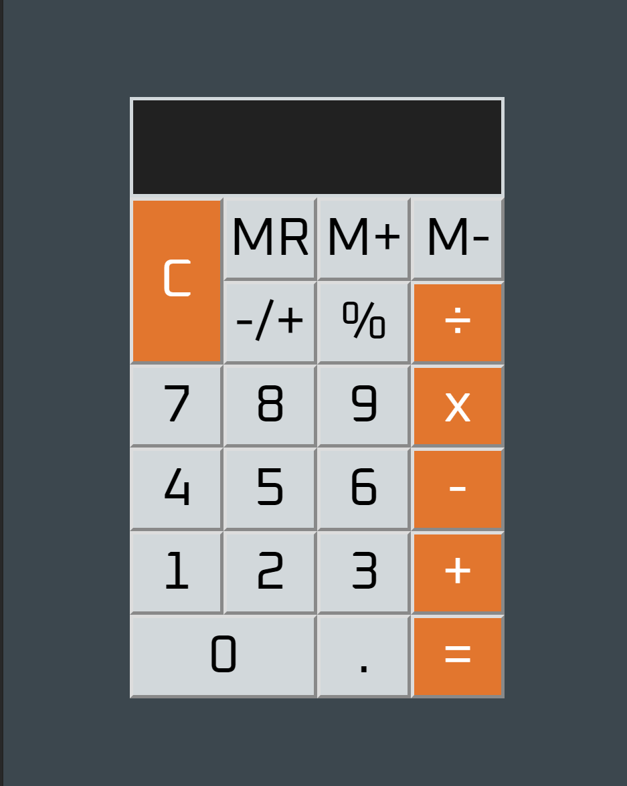

# Calculator App

Create a calculator application that should add, subtract, multiple and divide any two numbers. Display at least 10 digits on the screen. Display decimal to at least the thousandth. With add memory (M+), memory clear button (M-) and memory recall button (MR).

Here is the link to the calculator app: [calculator](https://m2paulc.github.io/calculator-app/)

You may also use your numerical keyboard to enter numbers and operations. Try it out!

## Summary

Using HTML, CSS and pure vanilla javascript. It's always good to practice javascript and dom manipulation. 

My solution to this was to use grid to design the layout. Implementation of the functionality would be handles by using ES6 class. I also implemented a previous display so the user may be able to see both numbers being calculated. Including sign, percentage and memory management. Let's not forget the issue with the parseFloat in javascript. Lastly;

* [x] - make it accessible
* [x] - allow keyboard controls on numbers, operations, enter for equals and esc key to clear display.

Creating this app certainly brings challenge which I'm always eager to solve. Overall, having this app under my belt creates more solid grasp on javascript programming. I had fun building this one.

## Author

Paul Caoile - Front-end Developer

